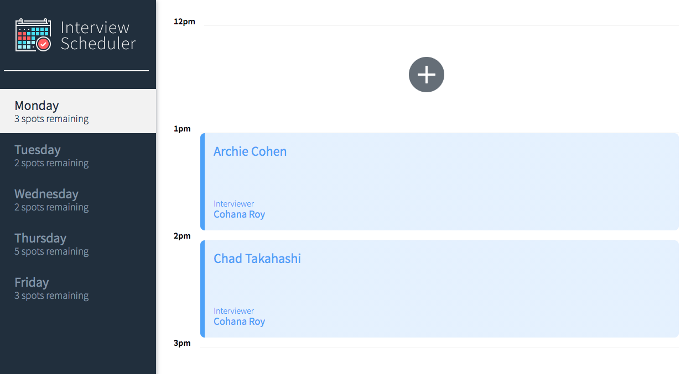
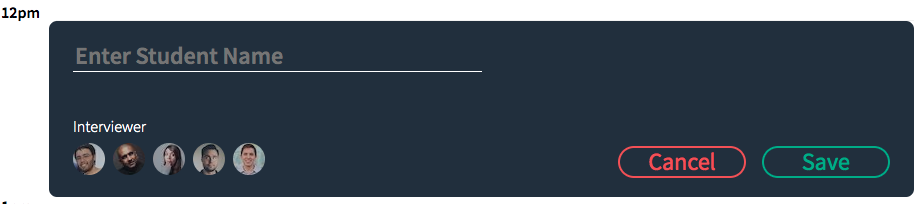
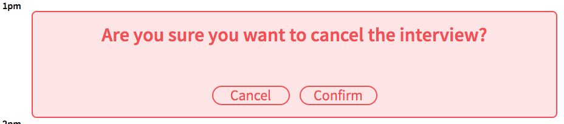
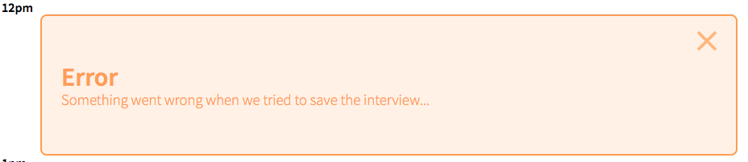

# Interview Scheduler

## Overview

A React App developed by [Nicholas Meisenheimer](https://github.com/souredoutlook) as part of the Lighthouse Labs curriculum. The core elements of the work focused on using a variety of React's features to create, and thoroughly test, highly interactive web-app. An additional feature that was implemented was the ability to use Websocket to update the state of multiple instances of the client in-realtime.

### Features

Landing page:

Add or edit an appointment:

Delete appointments:

Handle request errors (while running API in error mode):


### Dependencies

* React
* Webpack
* Babel
* Axios
* Storybook
* Jest
* React Testing Library
* Cypress

### Project Architecture 
The Scheduler client application created using Create React App. Express is the basis for the Scheduler API server application.

Both servers run concurrently; requests are proxied from the Webpack development server to the API server.

## Setup

Install dependencies with `npm install`.

You will also need to install and run the [scheduler-api server](https://github.com/lighthouse-labs/scheduler-api)

### Running Scheduler-Api
Running the server normally
```sh
npm start
```

Running the server so it returns an error when saving/deleting for testing the client's error handling capabilities
```sh
npm run error
```

Running the server in test mode for Cypress integration testing (requires configuration of env.test)
```sh
NODE_ENV=test npm start
```

## Running Webpack Development Server

```sh
npm start
```

## Running Jest Test Framework

```sh
npm test
```

## Running Cypress

```sh
npm run cypress
```

## Running Storybook Visual Testbed

```sh
npm run storybook
```
